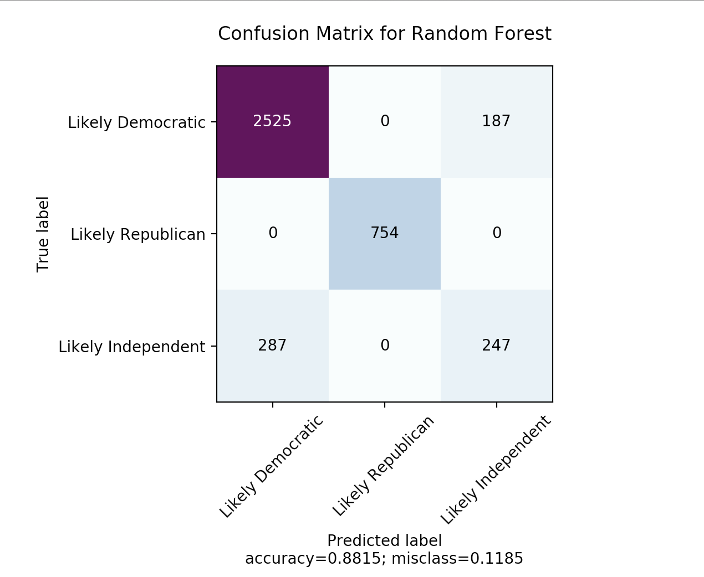
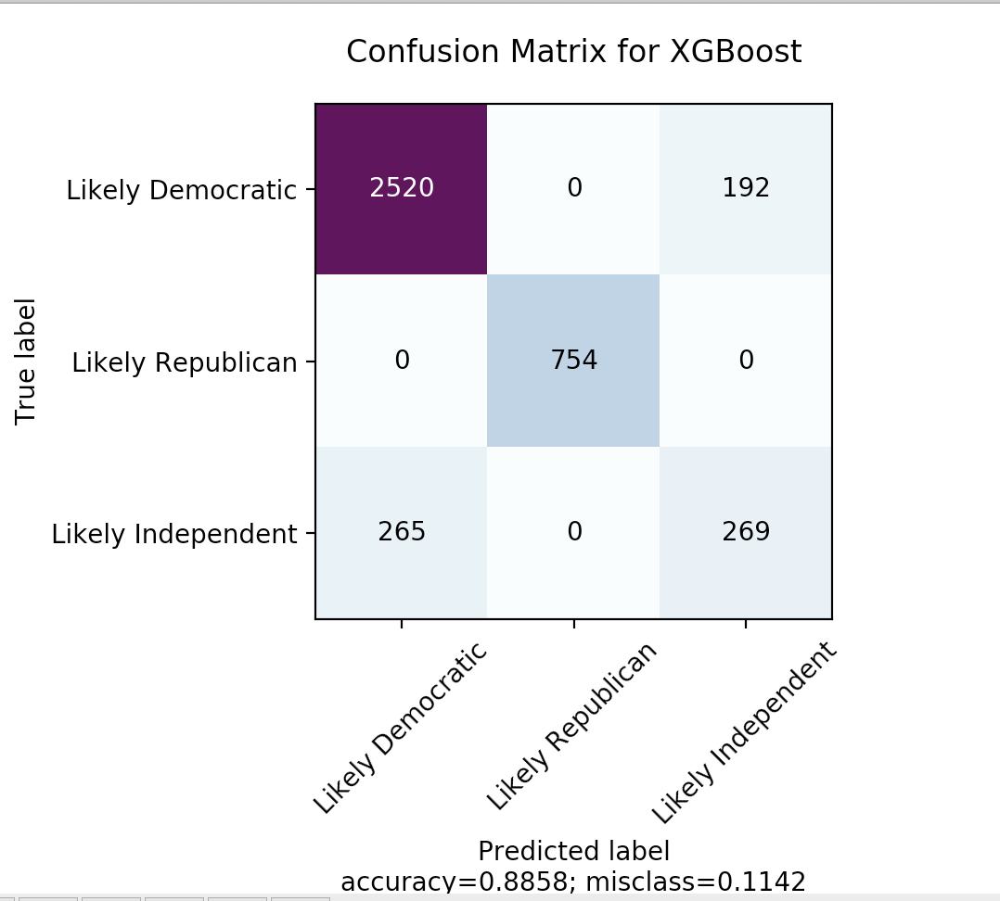
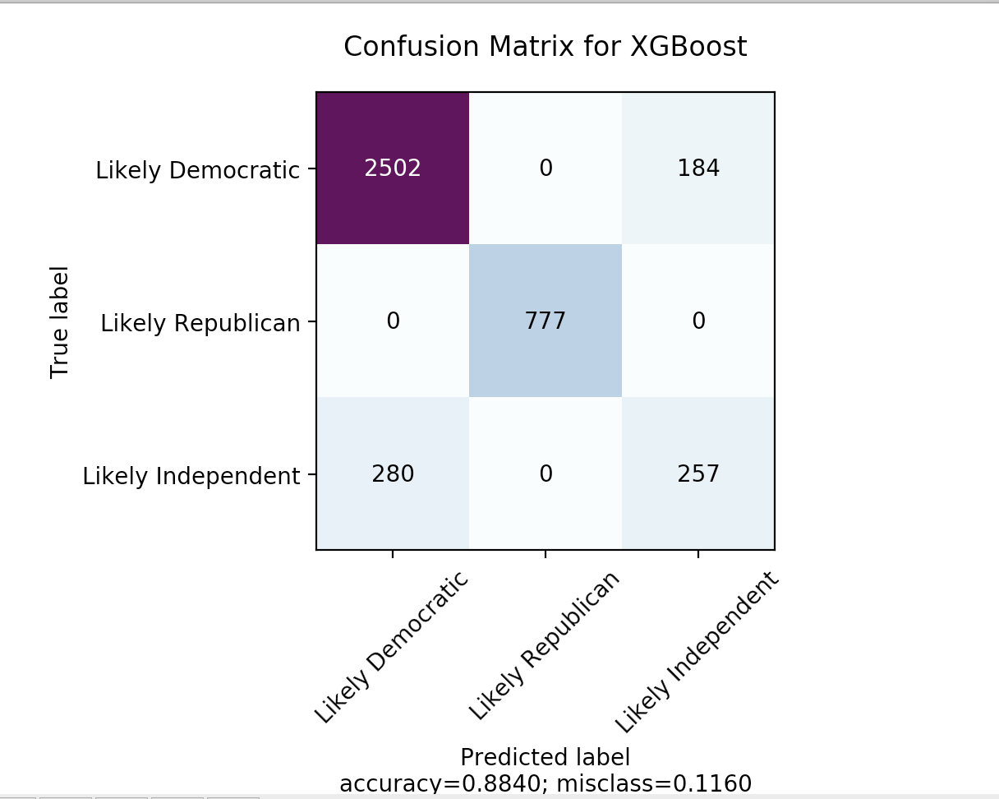
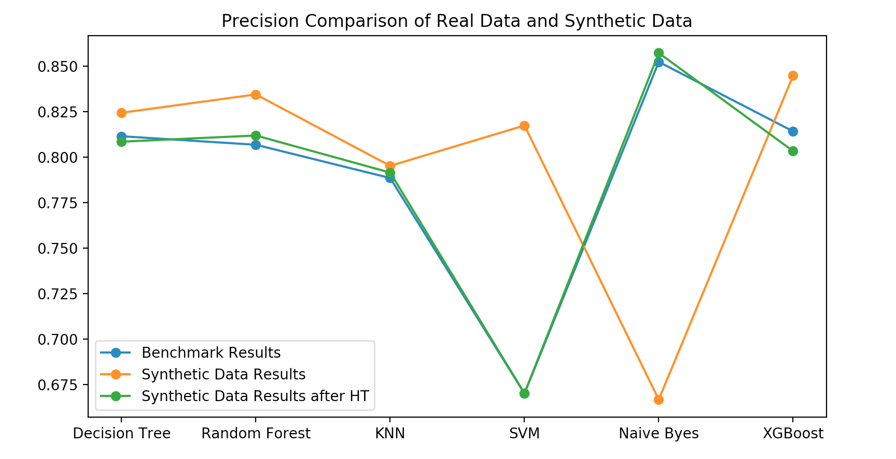

# Trend Based Election Synthetic Data

A common problem in a data set with imbalanced classes is that there are too few examples of the minority class for a model to learn the decision boundary effectively. This problem can be solved by increasing the samples in the minority class. The most widely used approach for synthesizing new examples is SMOTE, proposed by Nitesh Chawla et al. 
SMOTE goes beyond simple under or oversampling. This algorithm creates new instances of the minority class by creating convex combinations of neighboring instances. Python’s Imbalanced-Learn Library is used to implement SMOTE  
SMOTE works by selecting examples close in the feature space, drawing a line between the examples in the feature space, and drawing a new sample at a point along that line. 

# Results & Analysis
# Benchmark Results
  
 
 
# Benchmark Accuracy, Recall, Precision & f1-score

  
 

# SMOTE Results
  
 
 

# SMOTE Synthesized data's Accuracy, Recall, Precision & f1-score

  
 

# SMOTE with hyperparameter tuning Results
  
 
 

# Hyperparamter Tuning SMOTE Synthesized data's Accuracy, Recall, Precision & f1-score

  
 

# Comparitive Anlaysis
  

 

